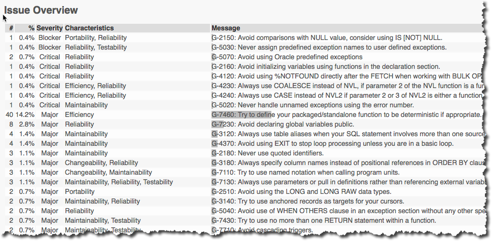
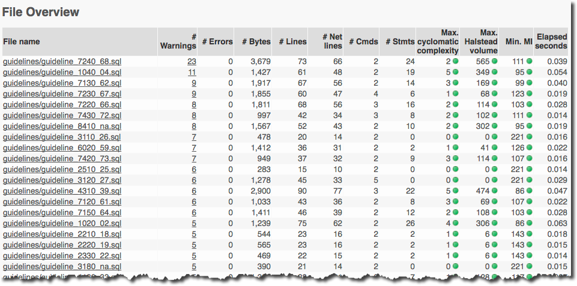
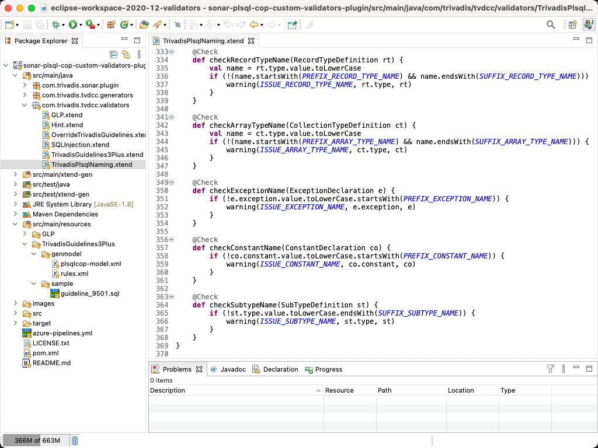

# PL/SQL Cop Command Line

## Introduction

Trivadis PL/SQL Cop is a command line utility to check Oracle SQL*Plus files for compliance violations of the [Trivadis PL/SQL & SQL Coding Guidelines Version 3.6](https://trivadis.github.io/plsql-and-sql-coding-guidelines/v3.6/).

Furthermore McCabe’s cyclomatic complexity, Halstead’s volume, the maintainability index and some other software metrics are calculated for each PL/SQL unit and aggregated on file level.

The code checking results are stored in XML, HTML and Excel files for further processing.

To get the most out of this command line utility you should make it part of your Continuous Integration environment by using the [PL/SQL Cop for SonarQube](https://github.com/Trivadis/plsql-cop-sonar) plugin. This way you may control the quality of your code base over time.

Have also a look at [PL/SQL Cop for SQL Developer](https://github.com/Trivadis/plsql-cop-sqldev) if you are interested to check the code quality of PL/SQL code within SQL Developer. It’s a free extension.

PL/SQL Cop supports custom validators. A validator must implement the `PLSQLCopValidator` Java interface and has to be a direct or indirect descendant of the `PLSQLJavaValidator` class.

You may use these validators as is or amend/extend them to suit your needs.

## Examples

Here are some screen shot taken from an of an HTML report based on the samples provided with PL/SQL Cop.

These [HTML](https://trivadis.github.io/plsql-cop-cli/tvdcc_report.html) and [Excel](https://trivadis.github.io/plsql-cop-cli/tvdcc_report.xlsx) reports have been created by PL/SQL Cop and are based on a simple set of good and bad example files distributed with PL/SQL Cop.

## Custom Guidelines as PL/SQL Cop Plugins

Since version 2.0 PL/SQL Cop supports custom validators. Such a validator must implement the PLSQLCopValidator Java interface and has to be a direct or indirect descendant of the PLSQLJavaValidator class. To simplify the development of a validator an example is provided as Maven project in a dedicated [GitHub repository](https://github.com/Trivadis/cop-validators). This example validator implements 15 guidelines to cover the [chapter 2.2 Naming Conventions of the Trivadis PL/SQL & SQL Coding Guidelines](https://trivadis.github.io/plsql-and-sql-coding-guidelines/2-naming-conventions/naming-conventions/). The following screenshot shows how checks are implemented.

## PL/SQL Editor for Eclipse

The following screenshot shows the test case for the checkConstantName method. The outline of the editor reveals the class name to be used for the check.

The editor is mainly provided to understand the PL/SQL model better. The full model is available as PLSQL.ecore file, which may be explored best within the Eclipse IDE.

## Releases

You find all releases and release information [here](https://github.com/Trivadis/plsql-cop-cli/releases).

## Issues
Please file your bug reports, enhancement requests, questions and other support requests within [Github's issue tracker](https://help.github.com/articles/about-issues/).

* [Questions](https://github.com/trivadis/plsql-cop-cli/issues?q=is%3Aissue+label%3Aquestion)
* [Open enhancements](https://github.com/trivadis/plsql-cop-cli/issues?q=is%3Aopen+is%3Aissue+label%3Aenhancement)
* [Open bugs](https://github.com/trivadis/plsql-cop-cli/issues?q=is%3Aopen+is%3Aissue+label%3Abug)
* [Submit new issue](https://github.com/trivadis/plsql-cop-cli/issues/new)

## Frequently Asked Questions

see [Frequently Ased Questions](FAQ.md).

## Further Information

Please find further information about PL/SQL Cop on the [Trivadis](https://www.trivadis.com/en/plsql-cop) website.

## License

The preview/trial version of PL/SQL Cop is licensed under the Creative Commons Attribution-NonCommercial-NoDerivs 3.0 Unported License. You may obtain a copy of the License at https://creativecommons.org/licenses/by-nc-nd/3.0/.

The trial/preview version provides full functionality but is limited in time and volume.

For production use a separate software license agreement is required.
